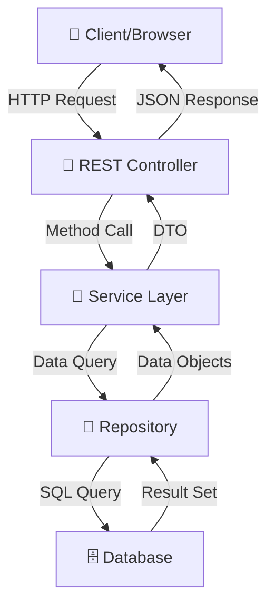
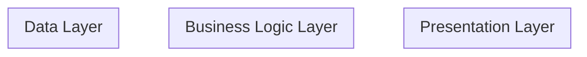

# core_java - Technical Documentation

This document provides a comprehensive technical analysis and architecture documentation for the project.

## Table of Contents


1. [Architecture Overview](#architecture-overview)
2. [Technology Stack](#technology-stack)
3. [Package Structure](#package-structure)
4. [Key Components](#key-components)
5. [Design Patterns](#design-patterns)
6. [Best Practices](#best-practices)
7. [Recommendations](#recommendations)

---

## System Architecture Overview


The core_java project follows a layered architecture pattern with clear separation of concerns:

- **Controllers** (0): Handle HTTP requests and responses
- **Services** (0): Contain business logic and orchestrate operations
- **Repositories** (0): Manage data access and persistence
- **Entities** (0): Represent database domain models
- **DTOs** (0): Transfer data between layers


## Data Flow Diagram

**Client-Server Data Flow**




## Component Interaction Diagram

**Layered Architecture Components**




## Technology Stack

*Technology stack could not be fully determined.*


## Package Structure

### `com.mycompany`

- **Main** (Class)
- **VariableDemo** (Class)

### `com.mycompany.abstractdemo`

- **AbstractMain** (Class)
- **ContractEmployee** (Class)
- **Employee** (Class)
- **must** (Class)

### `com.mycompany.accessmodifier`

- **Animal** (Class)
- **Bird** (Class)
- **Cat** (Class)

### `com.mycompany.accessmodifier.subpackage`

- **Lion2** (Class)

### `com.mycompany.accessmodifier2`

- **Lion** (Class)
- **Tiger** (Class)

### `com.mycompany.arraydemo`

- **ArrayDemo** (Class)
- **EmployeesIdProject** (Class)

### `com.mycompany.assignment1`

- **NumberSwap1** (Class)
- **NumberSwap2** (Class)
- **Pattern1** (Class)
- **Pattern2** (Class)
- **ReverseNumber** (Class)

### `com.mycompany.assignment3`

- **CountWords** (Class)
- **CountWords1** (Class)
- **UpperCase** (Class)

### `com.mycompany.assignment3.abstraction`

- **AbstractMain** (Class)
- **FourWheeler** (Class)
- **TwoWheeler** (Class)
- **Vehicle** (Class)

### `com.mycompany.assignment3.inheritance`

- **BioTeacher** (Class)
- **InheritanceMain** (Class)
- **PhyTeacher** (Class)
- **Teacher** (Class)

### `com.mycompany.assignment3.inheritance1`

- **InheritanceMain** (Class)
- **School** (Class)
- **Subject** (Class)
- **Teacher** (Class)

### `com.mycompany.collectiondemo.listdemo`

- **GenericsListDemo** (Class)
- **ListDemoOne** (Class)
- **ListDemoTwo** (Class)

### `com.mycompany.collectiondemo.mapdemo`

- **MapDemoOne** (Class)

### `com.mycompany.collectiondemo.setdemo`

- **SetDemo** (Class)

### `com.mycompany.constructordemo`

- **Shape** (Class)
- **ShapeMain** (Class)

### `com.mycompany.controlstatement`

- **IfElseDemo** (Class)

### `com.mycompany.day17handson.q1`

- **C1** (Class)

### `com.mycompany.day17handson.q10`

- **C10** (Class)

### `com.mycompany.day17handson.q11`

- **C11** (Class)

### `com.mycompany.day17handson.q12`

- **C12_1** (Class)
- **C12_2** (Class)

### `com.mycompany.day17handson.q13`

- **C13_1** (Class)
- **C13_2** (Class)

### `com.mycompany.day17handson.q14`

- **C14_1** (Class)
- **C14_2** (Class)

### `com.mycompany.day17handson.q15`

- **C15** (Class)

### `com.mycompany.day17handson.q16`

- **C16_1** (Class)
- **C16_2** (Class)

### `com.mycompany.day17handson.q2`

- **Bike** (Class)
- **Vehicle** (Class)
- **VehicleMain** (Class)

### `com.mycompany.day17handson.q3`

- **Bank** (Class)
- **BankCustomer** (Class)
- **ICICIBank** (Class)
- **SBIBank** (Class)

### `com.mycompany.day17handson.q4`

- **Animal** (Class)
- **AnimalMain** (Class)
- **Bird** (Class)
- **Dog** (Class)

### `com.mycompany.day17handson.q5`

- **C5** (Class)

### `com.mycompany.day17handson.q6`

- **C6** (Class)

### `com.mycompany.day17handson.q7`

- **C7** (Class)

### `com.mycompany.day17handson.q8`

- **C8** (Class)

### `com.mycompany.day17handson.q9`

- **C** (Class)

### `com.mycompany.day8bookauthorproject`

- **AuthorModel** (Class)
- **Book** (Class)
- **BookAuthorMain** (Class)

### `com.mycompany.day8bookauthorprojectsolution`

- **Author** (Class)
- **AuthorBookMain** (Class)
- **Book** (Class)

### `com.mycompany.exceptiondemo`

- **CustomExceptionMain** (Exception)
- **Exception1Main** (Exception)
- **Exception2Main** (Exception)
- **Exception3Main** (Exception)
- **Exception4Main** (Exception)
- **FinallyBlockMain** (Exception)
- **InvalidAgeException** (Exception)
- **J1** (Exception)
- **J2** (Exception)
- **J3** (Exception)

### `com.mycompany.exceptiondemo.exceptionassignment`

- **BusinessException** (Exception)
- **BusinessLayer** (Exception)
- **ClientMain** (Exception)

### `com.mycompany.exceptiondemo.exceptionassignment1`

- **BusinessException1** (Exception)
- **BusinessLayer1** (Exception)
- **ClientMain1** (Exception)
- **UILayer1** (Exception)

### `com.mycompany.filedemo`

- **import** (Class)
- **public** (Class)

### `com.mycompany.finaldemo`

- **Apple** (Class)
- **FinalDemoMain** (Class)
- **Fruit** (Class)

### `com.mycompany.inheritancedemo`

- **Bike** (Class)
- **Car** (Class)
- **InheritanceMain** (Class)
- **Vehicle** (Class)

### `com.mycompany.interfacedemo`

- **Animal** (Class)
- **AnimalMain** (Class)
- **Bird** (Class)
- **SuperAnimal** (Class)
- **Tiger** (Class)

### `com.mycompany.jdbcdemo`

- **JdbcDeleteDemo** (Class)
- **JdbcInsertDemo** (Class)
- **JdbcSelectDemo** (Class)
- **JdbcUpdateDemo** (Class)

### `com.mycompany.jsondemo`

- **Address** (Class)
- **Company** (Class)
- **GeoLocation** (Class)
- **JSONDemo** (Class)
- **User** (Class)

### `com.mycompany.multithreading`

- **ThreadDemoOneMain** (Class)
- **ThreadDemoTwo** (Class)
- **ThreadExample2Main** (Class)
- **public** (Class)

### `com.mycompany.objectclasses`

- **Employee** (Class)
- **EmployeeMain** (Class)
- **EmployeeMainNew** (Class)

### `com.mycompany.polymorphismdemo`

- **Area** (Class)
- **AreaMain** (Class)

### `com.mycompany.roughwork`

- **ArrayElementDeletion** (Class)
- **forEachLoop** (Class)

### `com.mycompany.serializationdemo`

- **DeserializationMain** (Class)
- **Product** (Class)
- **SerializationMain** (Class)

### `com.mycompany.serializationdemo.assignment`

- **Car** (Class)
- **DeserializationListMapMain** (Class)
- **DeserializationMain** (Class)
- **Employee** (Class)
- **Product** (Class)
- **SerializationListMapMain** (Class)
- **SerializationMain** (Class)
- **Student** (Class)

### `com.mycompany.serializationdemo.assignment.usinglist`

- **Deserialize** (Class)
- **Employee** (Class)
- **Serialize** (Class)

### `com.mycompany.staticdemo`

- **StaticPractice** (Class)

### `com.mycompany.stringdemo`

- **CompareTo** (Class)
- **StringBuilderMain** (Class)
- **StringMain** (Class)
- **StringOperationsMain** (Class)

### `com.mycompany.variablesdatatypes`

- **VariableDemo** (Class)

### `com.mycompany.wrapperdemo`

- **WrapperMain** (Class)


## Entity Relationship Overview

*No entities found in this project.*


## Key Classes and Relationships

**Key Classes**

```mermaid

graph TD

```


## Key Components


## Design Patterns Identified

*Common design patterns could not be clearly identified.*


## Best Practices & Observations

✅ Custom exception handling for domain-specific errors


## Recommendations

- 📌 **Add comprehensive unit tests** with JUnit 5 and Mockito for all service layer methods

- 📌 **Implement logging** using SLF4J with appropriate log levels for debugging and monitoring

- 📌 **Add API versioning** to handle backward compatibility in future releases

- 📌 **Document API endpoints** thoroughly with clear examples and use cases

- 📌 **Implement caching strategies** where applicable to improve performance

- 📌 **Add security features** like authentication (JWT) and authorization (Spring Security)

- 📌 **Implement pagination** for list endpoints to handle large datasets efficiently

- 📌 **Add input validation** and error handling middleware for consistent error responses
