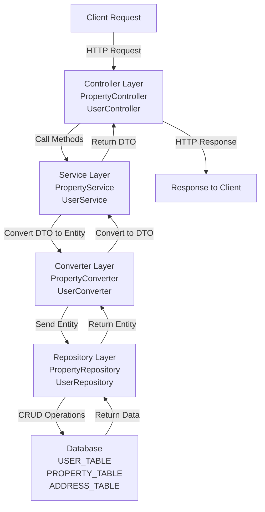
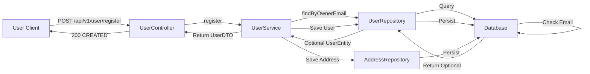
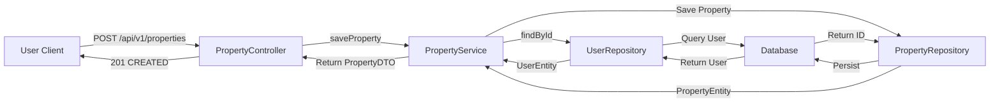
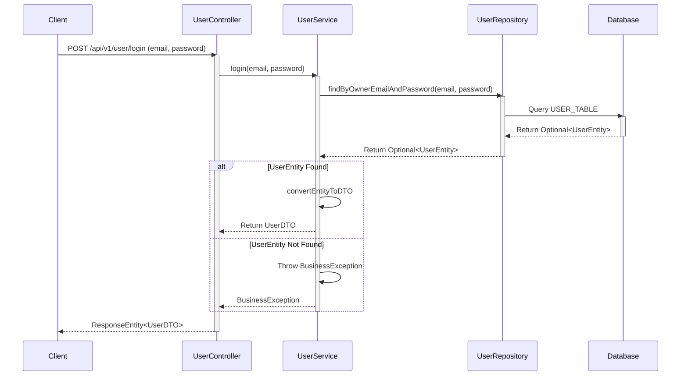
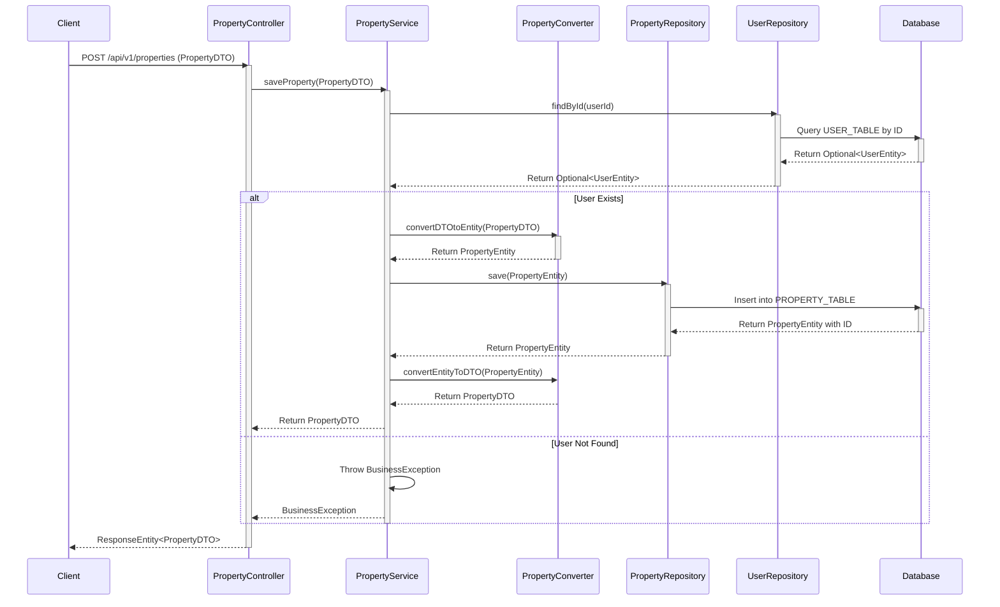
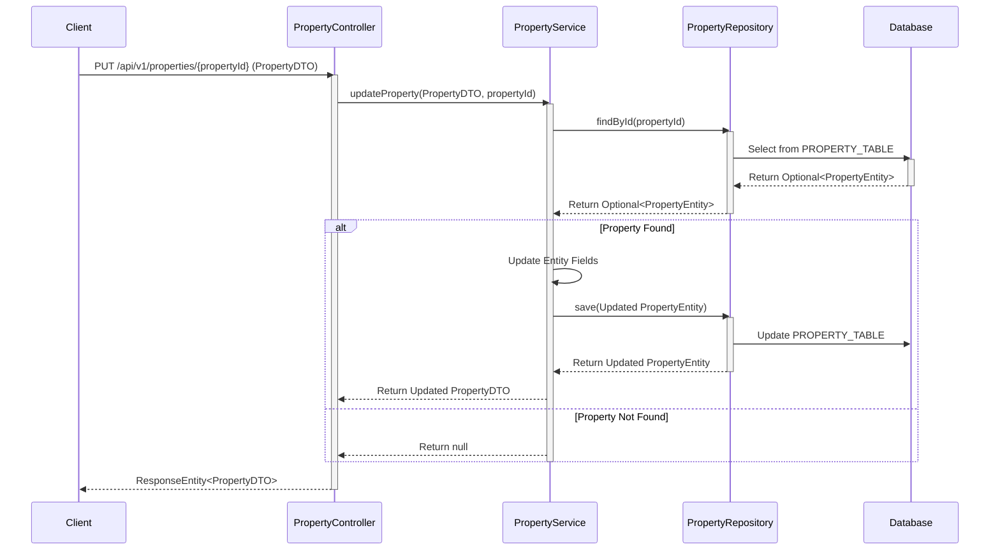
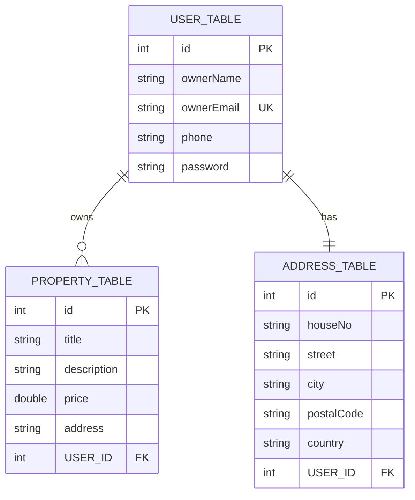

# Property Management System - Architecture Documentation

**Generated:** March 1, 2026  
**Project:** Property Management Application  
**Version:** 1.0

---

## Table of Contents
1. [Overview](#overview)
2. [Data Flow Diagram](#data-flow-diagram)
3. [Interaction Diagrams](#interaction-diagrams)
4. [Sequence Diagrams](#sequence-diagrams)
5. [Class Diagram](#class-diagram)
6. [Entity-Relationship (ER) Diagram](#entity-relationship-diagram)
7. [Code Walkthrough](#code-walkthrough)
8. [Summary and Observations](#summary-and-observations)

---

## Overview

The Property Management System is a Spring Boot REST API application designed to manage property listings and user accounts. The system follows a layered architecture pattern with clear separation of concerns including controllers, services, repositories, and data entities.

**Technology Stack:**
- Spring Boot Framework
- Spring Data JPA
- REST API
- Lombok
- Jakarta Persistence API (JPA)
- Swagger/OpenAPI Documentation

---

## Data Flow Diagram



---

## Interaction Diagrams

### User Registration Interaction Flow



### Property Management Interaction Flow



---

## Sequence Diagrams

### User Login Sequence



### Save Property Sequence



### Update Property Sequence



---

## Class Diagram

```mermaid
classDiagram
    class PropertyManagementApplication {
        +main(String[] args)
    }
    
    class PropertyController {
        -dummy: String
        -dbUrl: String
        -propertyService: PropertyService
        +sayHello(): String
        +saveProperty(PropertyDTO): ResponseEntity
        +getAllProperties(): ResponseEntity
        +getAllPropertiesForUser(Long): ResponseEntity
        +updateProperty(PropertyDTO, Long): ResponseEntity
        +updatePropertyDescription(PropertyDTO, Long): ResponseEntity
        +updatePropertyPrice(PropertyDTO, Long): ResponseEntity
        +deleteProperty(Long): ResponseEntity
    }
    
    class UserController {
        -userService: UserService
        +register(UserDTO): ResponseEntity
        +login(UserDTO): ResponseEntity
    }
    
    class PropertyService {
        <<interface>>
        +saveProperty(PropertyDTO): PropertyDTO
        +getAllProperties(): List
        +getAllPropertiesForUser(Long): List
        +updateProperty(PropertyDTO, Long): PropertyDTO
        +updatePropertyDescription(PropertyDTO, Long): PropertyDTO
        +updatePropertyPrice(PropertyDTO, Long): PropertyDTO
        +deleteProperty(Long): void
    }
    
    class PropertyServiceImpl {
        -dummy: String
        -dbUrl: String
        -propertyRepository: PropertyRepository
        -propertyConverter: PropertyConverter
        -userRepository: UserRepository
        +saveProperty(PropertyDTO): PropertyDTO
        +getAllProperties(): List
        +getAllPropertiesForUser(Long): List
        +updateProperty(PropertyDTO, Long): PropertyDTO
        +updatePropertyDescription(PropertyDTO, Long): PropertyDTO
        +updatePropertyPrice(PropertyDTO, Long): PropertyDTO
        +deleteProperty(Long): void
    }
    
    class UserService {
        <<interface>>
        +register(UserDTO): UserDTO
        +login(String, String): UserDTO
    }
    
    class UserServiceImpl {
        -userRepository: UserRepository
        -addressRepository: AddressRepository
        -userConverter: UserConverter
        +register(UserDTO): UserDTO
        +login(String, String): UserDTO
    }
    
    class PropertyDTO {
        -id: Long
        -title: String
        -description: String
        -price: Double
        -address: String
        -userId: Long
    }
    
    class UserDTO {
        -id: Long
        -ownerName: String
        -ownerEmail: String
        -phone: String
        -password: String
        -houseNo: String
        -street: String
        -city: String
        -postalCode: String
        -country: String
    }
    
    class PropertyEntity {
        -id: Long
        -title: String
        -description: String
        -price: Double
        -address: String
        -userEntity: UserEntity
    }
    
    class UserEntity {
        -id: Long
        -ownerName: String
        -ownerEmail: String
        -phone: String
        -password: String
    }
    
    class AddressEntity {
        -id: Long
        -houseNo: String
        -street: String
        -city: String
        -postalCode: String
        -country: String
        -userEntity: UserEntity
    }
    
    class PropertyRepository {
        <<interface>>
        +findAllByUserEntityId(Long): List
    }
    
    class UserRepository {
        <<interface>>
        +findByOwnerEmailAndPassword(String, String): Optional
        +findByOwnerEmail(String): Optional
    }
    
    class AddressRepository {
        <<interface>>
    }
    
    class PropertyConverter {
        +convertDTOtoEntity(PropertyDTO): PropertyEntity
        +convertEntityToDTO(PropertyEntity): PropertyDTO
    }
    
    class UserConverter {
        +convertDTOtoEntity(UserDTO): UserEntity
        +convertEntityToDTO(UserEntity): UserDTO
    }
    
    class BusinessException {
        -errorModelList: List
        +getErrorModelList(): List
    }
    
    class ErrorModel {
        -code: String
        -message: String
    }
    
    PropertyController --> PropertyService
    PropertyController --> PropertyServiceImpl
    PropertyServiceImpl --|> PropertyService
    PropertyServiceImpl --> PropertyRepository
    PropertyServiceImpl --> UserRepository
    PropertyServiceImpl --> PropertyConverter
    
    UserController --> UserService
    UserController --> UserServiceImpl
    UserServiceImpl --|> UserService
    UserServiceImpl --> UserRepository
    UserServiceImpl --> AddressRepository
    UserServiceImpl --> UserConverter
    
    PropertyEntity --> UserEntity
    AddressEntity --> UserEntity
    
    PropertyDTO -.-> PropertyEntity
    UserDTO -.-> UserEntity
    
    PropertyRepository --> PropertyEntity
    UserRepository --> UserEntity
    AddressRepository --> AddressEntity
    
    PropertyConverter -.-> PropertyDTO
    PropertyConverter -.-> PropertyEntity
    UserConverter -.-> UserDTO
    UserConverter -.-> UserEntity
    
    BusinessException o-- ErrorModel
```

---

## Entity-Relationship (ER) Diagram



---

## Code Walkthrough

### 1. Property Management Application Entry Point

**File:** `PropertyManagementApplication.java`

The application is initialized using Spring Boot's annotation-based configuration:

```java
@SpringBootApplication
public class PropertyManagementApplication {
    public static void main(String[] args) {
        SpringApplication.run(PropertyManagementApplication.class, args);
    }
}
```

**Purpose:** This class serves as the entry point for the Spring Boot application. The `@SpringBootApplication` annotation combines `@Configuration`, `@ComponentScan`, and `@EnableAutoConfiguration`.

---

### 2. API Layer - Controllers

#### PropertyController

**Purpose:** Handles all REST endpoints related to property management.

**Key Endpoints:**
- `GET /api/v1/hello` - Simple health check endpoint
- `POST /api/v1/properties` - Create new property
- `GET /api/v1/properties` - Retrieve all properties
- `GET /api/v1/properties/users/{userId}` - Retrieve properties for specific user
- `PUT /api/v1/properties/{propertyId}` - Full property update
- `PATCH /api/v1/properties/update-description/{propertyId}` - Update description only
- `PATCH /api/v1/properties/update-price/{propertyId}` - Update price only
- `DELETE /api/v1/properties/{propertyId}` - Delete property

**Key Features:**
- Field injection using `@Autowired` for `PropertyService`
- `@Value` annotation for configuration properties (`pms.dummy`, `spring.datasource.url`)
- Proper HTTP status codes (201 for CREATED, 200 for OK, 204 for NO_CONTENT)
- All responses wrapped in `ResponseEntity` for better control

#### UserController

**Purpose:** Handles user authentication and registration operations.

**Key Endpoints:**
- `POST /api/v1/user/register` - User registration
- `POST /api/v1/user/login` - User login

**Key Features:**
- Uses JWT validation through `@Valid` annotation
- OpenAPI/Swagger documentation annotations
- Parameter documentation with `@Parameter`

---

### 3. Service Layer - Business Logic

#### PropertyService Interface

Defines the contract for property-related operations:

```
saveProperty(PropertyDTO)
getAllProperties()
getAllPropertiesForUser(Long userId)
updateProperty(PropertyDTO, Long propertyId)
updatePropertyDescription(PropertyDTO, Long propertyId)
updatePropertyPrice(PropertyDTO, Long propertyId)
deleteProperty(Long propertyId)
```

#### PropertyServiceImpl Implementation

**Key Operations:**

1. **Save Property:**
   - Validates that user exists before saving property
   - Throws `BusinessException` if user not found
   - Converts DTO to Entity
   - Associates property with user
   - Converts saved entity back to DTO

2. **Get All Properties:**
   - Retrieves all properties from repository
   - Converts each entity to DTO for response

3. **Get Properties by User:**
   - Uses repository method `findAllByUserEntityId()`
   - Batch converts entities to DTOs

4. **Update Operations:**
   - Full update: Updates all fields (title, address, price, description)
   - Partial updates: Update specific fields only (description or price)
   - Returns null if property not found

5. **Delete Property:**
   - Direct delegation to repository's `deleteById()`

#### UserService Interface

Defines the contract for user-related operations:

```
register(UserDTO)
login(String email, String password)
```

#### UserServiceImpl Implementation

**Key Operations:**

1. **Register User:**
   - Checks if email already exists (duplicate prevention)
   - Throws `BusinessException` with error code `EMAIL_ALREADY_EXIST` if found
   - Creates user entity from DTO
   - Saves user to database
   - Creates associated address entity
   - Saves address to database
   - Returns user DTO

2. **Login:**
   - Queries database for user with matching email and password
   - Throws `BusinessException` with code `INVALID_LOGIN` if not found
   - Converts entity to DTO and returns

---

### 4. Data Access Layer - Repositories

#### PropertyRepository

Extends `CrudRepository<PropertyEntity, Long>` with custom finder method:
- `findAllByUserEntityId(Long userId)` - Spring Data JPA convention method

#### UserRepository

Extends `CrudRepository<UserEntity, Long>` with custom finder methods:
- `findByOwnerEmailAndPassword(String email, String password)` - Returns Optional
- `findByOwnerEmail(String email)` - Returns Optional

#### AddressRepository

Extends `CrudRepository<AddressEntity, Long>` for basic CRUD operations.

---

### 5. Data Models - Entities

#### UserEntity

```
Table: USER_TABLE
- id (PK, Auto-generated)
- ownerName
- ownerEmail (Unique, Not Null)
- phone
- password
- Relationships: One-to-Many with PropertyEntity, One-to-One with AddressEntity
```

#### PropertyEntity

```
Table: PROPERTY_TABLE
- id (PK, Auto-generated)
- title (Not Null)
- description
- price
- address
- userEntity (FK to USER_TABLE, Many-to-One)
```

#### AddressEntity

```
Table: ADDRESS_TABLE
- id (PK, Auto-generated)
- houseNo
- street
- city
- postalCode
- country
- userEntity (FK to USER_TABLE, One-to-One)
```

---

### 6. Data Transfer Objects (DTOs)

#### PropertyDTO

Transfer object for property data containing:
- id, title, description, price, address, userId

**Purpose:** Serves as request/response body for property API endpoints.

#### UserDTO

Transfer object for user data containing:
- id, ownerName, ownerEmail, phone, password
- Address fields: houseNo, street, city, postalCode, country

**Features:**
- `@Getter` and `@Setter` from Lombok
- `@JsonInclude(Include.NON_NULL)` - Excludes null fields from JSON
- `@JsonIgnoreProperties(ignoreUnknown=true)` - Ignores unknown properties during deserialization
- Validation annotations:
  - `@NotNull` and `@NotEmpty` on ownerEmail
  - `@Size(min=1, max=50)` on ownerEmail
  - `@NotNull` and `@NotEmpty` on password

---

### 7. Converters - DTO to Entity Mapping

#### PropertyConverter and UserConverter

Responsible for converting between DTOs and Entities:
- `convertDTOtoEntity()` - Converts DTO to Entity (for persistence)
- `convertEntityToDTO()` - Converts Entity to DTO (for API responses)

**Purpose:** Provides clean separation between API layer (DTOs) and persistence layer (Entities).

---

### 8. Exception Handling

#### BusinessException

Custom exception for business logic violations (non-technical errors):
- Wraps a list of `ErrorModel` objects
- Each error contains code and message

#### ErrorModel

Structure for error details:
- code: Error identifier (e.g., "USER_ID_NOT_EXIST", "EMAIL_ALREADY_EXIST", "INVALID_LOGIN")
- message: Human-readable error message

#### CustomExceptionHandler

Handles exceptions globally and returns structured error responses.

---

## Summary and Observations

### Architecture Strengths

1. **Layered Architecture:** Clear separation of concerns with Controller → Service → Repository layers
2. **REST API Design:** Follows REST principles with appropriate HTTP methods and status codes
3. **Data Transfer Objects:** DTOs provide clean API contracts separate from database entities
4. **Spring Data JPA:** Leverages data repositories for clean database access
5. **Exception Handling:** Custom exceptions with structured error responses
6. **Converter Pattern:** Separate converters for DTO-Entity mapping

### Key Data Flows

1. **User Registration:**
   - Client → Controller → Service → Converters → Repository → Database
   - Includes validation and address creation

2. **Property Management:**
   - Full CRUD operations on properties
   - User association validation
   - Support for partial updates via PATCH methods

3. **Authentication:**
   - Email and password-based login
   - Simple authentication without JWT tokens

### Database Schema

The system uses three main tables:
- **USER_TABLE:** Stores user credentials and information
- **PROPERTY_TABLE:** Stores property listings linked to users
- **ADDRESS_TABLE:** Stores address information linked to users

**Relationships:**
- One user can own multiple properties (1:N)
- One user has exactly one address (1:1)

### Configuration

The application uses environment-specific configuration files:
- `application-local.properties`
- `application-dev.properties`
- `application-acc.properties`
- `application-prod.properties`
- `application-test.properties`

### Best Practices Observed

✅ Lombok annotations for reducing boilerplate  
✅ Spring annotations for dependency injection  
✅ Repository pattern for data access  
✅ Service layer for business logic  
✅ DTOs for API contracts  
✅ Optional for null-safety in queries  
✅ Validation annotations on DTOs  
✅ ResponseEntity for flexible responses  

---

**Document Generated:** Property Management System Architecture Analysis  
**Scope:** Complete system walkthrough with diagrams and code documentation  
**Status:** Ready for developer reference and onboarding

